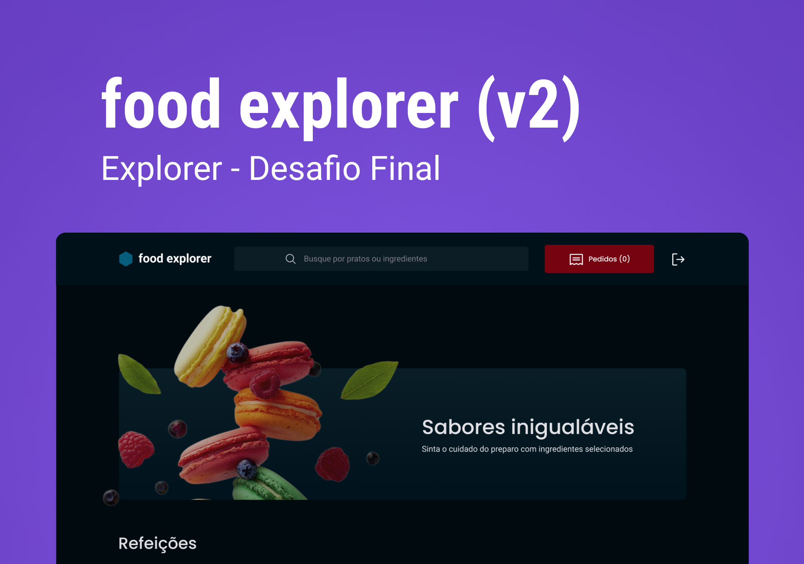

<h1>Food Explorer </h1>

 

<h3>Descrição do projeto</h3>

Projeto final do bootcamp explorer da rockeseat

<h3>Funcionalidades</h3>
<ul>
  <li>Cadastro de usuário</li>
  <li>Cadastro de produto</li>
  <li>Carrinho de compras</li>
  <li>Edição de produto</li>

</ul>

<h3>🛠 Tecnologias</h3>
<ul>
  <li>React</li>
  <li>Styled-Components</li>
  <li>Phospor-React</li>
  <li>Axios</li>

</ul>

<h3>Como usar</h3>
<ul>
  <li>Para usar este projeto você precisa clonar este repositório e clonar 
  </li>

  <li>Depois do projeto clonado é necessário dar um npm install para intalar as depêndencias e depois um npm run dev para rodar </li>

</ul>

<h3>Autor</h3>

Gabriel Viana
